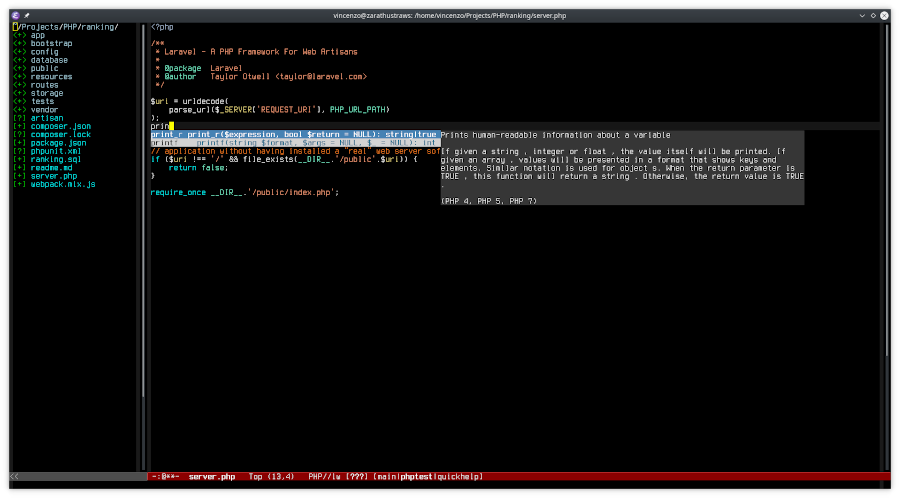
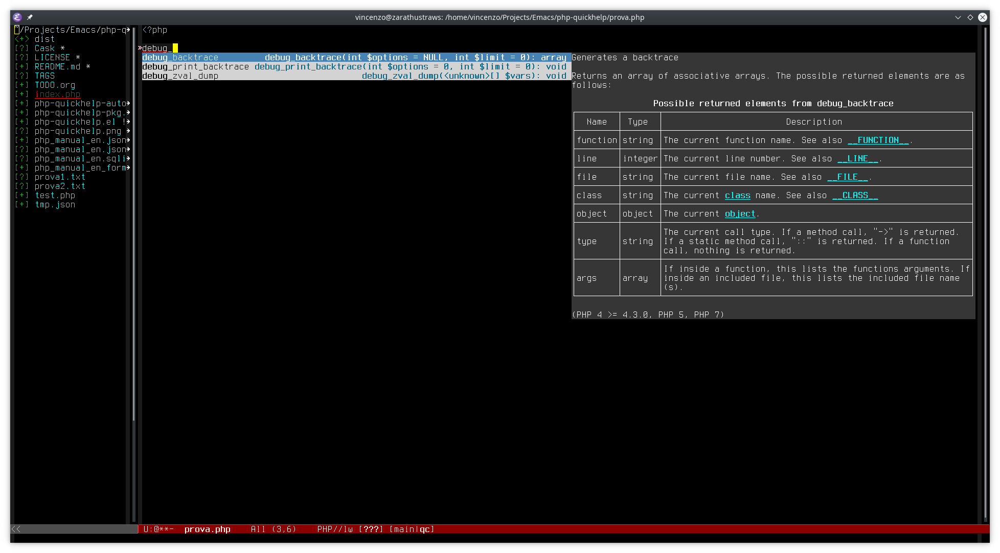

# php-quickhelp [](https://melpa.org/#/php-quickhelp) [](http://stable.melpa.org/#/php-quickhelp)

Provide quick help (and a eldoc beckend) for company-php and company-phpactor.
It require [jq](https://stedolan.github.io/jq/ "Jq cmd-line json processor")
to extract a short help from php manual.



## Installation

You can install `php-quickhelp` from [MELPA](http://melpa.org/#/php-quickhelp)
or [MELPA Stable](http://stable.melpa.org/#/php-quickhelp) with `package.el`

```
 M-x package-install php-quickhelp
```

## Usage

After having installed this package, run `php-quickhelp-download-or-update` which
downloads, from php.net, the php_manual_en.json file
into `~/.emacs.d/php-quickhelp-manual` directory.

php-quickhelp now support not only shr but even w3m (prefered) for
documentation rendering. If you install w3m extension and the w3m
browser (see [W3M Site](http://w3m.sourceforge.net/) or your software repo) and
you set `display_borders 1` option in w3m config file, the rendering look like this:



php-quickhelp can be used with or without company-php, company-phpactor and company-quickhelp.
When used with company-php, company-phpactor and company-quickhelp
(and company-quickhelp-terminal if you want to use with console), it works
like a wrapper for company-php or company-phpactor.

For company-phpactor you can do something like this (you must activate company-quickhelp-mode):

``` elisp
(add-hook 'php-mode-hook (lambda ()
    ;; .... other configs
    (require ''company-phpactor)
    (require 'php-quickhelp)
    (set (make-local-variable 'company-backends)
    '(php-quickhelp-company-phpactor company-web-html company-dabbrev-code company-files))
(company-mode)))

```

For company-php, something like this:

``` elisp
(add-hook 'php-mode-hook (lambda ()
    ;; .... other configs
    (require 'company-php)
    (require 'php-quickhelp)
    (set (make-local-variable 'company-backends)
    '(php-quickhelp-company-php company-web-html company-dabbrev-code company-files))
(company-mode)))

```

If you want to use the eldoc backend you can put, in your php-mode-hook, this:

``` elisp
(setq eldoc-documentation-function
       'php-quickhelp-eldoc-func)
```

The function `php-quickhelp-at-point` can be used to
show the documentation in the echo area or in a temp buffer (if text is too long).

If you hit `M-x customize-group <RET> php-quickhelp <RET>` you'll
find a few variables you can diddle.

## TODO

- ac-php support

## ISSUE

- html table rendering inside tooltips isn't good in some cases with `shr`
